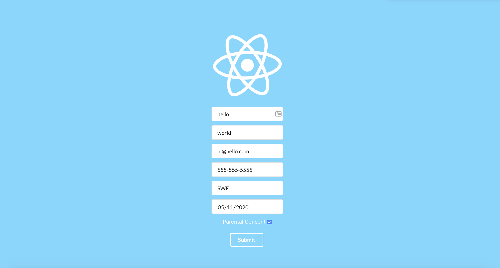

## Form Project Details

### `yarn start`

Runs the app in the development mode. 
Open [http://localhost:3000](http://localhost:3000) to view it in the browser.

#### With valid inputs, including conditional shown when age entered < 13 years:

#### JSON object on submit:

#### Conditional input not shown when age > 13 years:

#### Phone number validation:

### `yarn test`

Launches the test runner in the interactive watch mode. 

